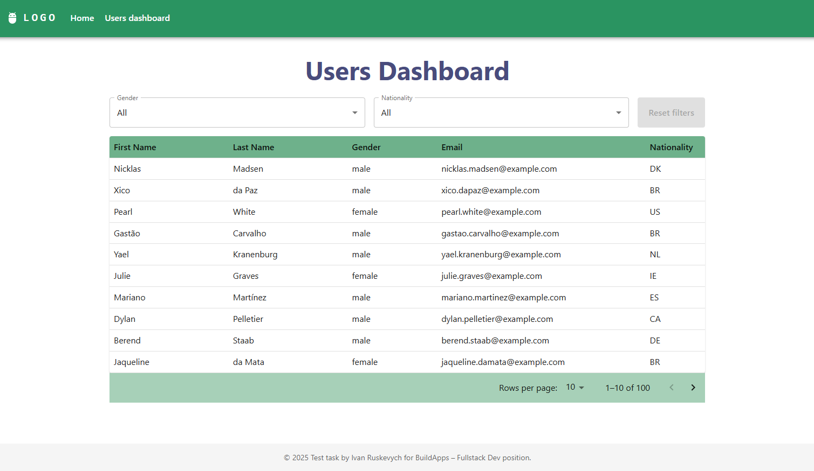

# test-build_apps



### 🚀 Getting Started

#### Clone & Install

```bash
    git clone https://github.com/IvanRuskevych/test-build_apps.git
    cd test-build_apps
    npm install
```

#### Create Environment File

```bash
  cp .env.example .env
```

#### Start the Server

```bash
  npm run dev
```

The app will be available at:

```
http://localhost:5173
```

---

### 🛠 Technologies Used

- **React 19 + TypeScript**
- **Vite (project scaffolding & build tool)**
- **Material UI (MUI) for UI components**
- **Axios for HTTP requests**
- **Zod for runtime schema validation**
- **React Router v7 for navigation**
- **React Toastify for notifications**

---

## 📜 Custom Hooks Overview

- **useUsers** - Fetches the user list from the API based on the current page, page size, gender, and nationality.
  Manages loading state.
- **useUserFilters** - Reads and updates pagination and filter values from/to URL query parameters (0-based pagination
  for MUI compatibility).
- **useBreakpoints** - Provides responsive layout logic based on the current viewport width (e.g., `isMobile` flag).

---

## 🧪 How to Use

- **Home page** - the app's start page
- **User dashboard** - access via the link in the Top Bar or the burger menu in the mobile version
- **Table filtering available by Gender and Nationality fields**, with a Reset Filters button to clear filters
- **Pagination implemented in the user table**
- **Reset Filters button**
- **Loading states**
- **Responsive design**

---

## 📦 Solution & Structure

This project is built using React, TypeScript, and Vite for fast development and builds.  
The structure is organized for scalability and maintainability:

- **pages/** - top-level page components (e.g., `HomePage`, `UsersPage`).
- **routes/** - routing configuration using `react-router-dom` v7 with layouts.
- **schemas/** - Zod schemas for API response validation.
- **services/** - `httpService` and `userService` for fetching users.
- **components/**
    - `FilterBar` - gender & nationality selectors plus a reset button.
    - `UserTable` - paginated user table.
    - `LabeledSelectCustom` - reusable labeled select component.
    - `TablePaginationCustom` - wrapper around MUI’s `TablePagination` component.
- **hooks/**
    - `useUsers` - fetches user data based on filters and pagination.
    - `useUserFilters` - synchronizes filters and pagination with URL query parameters.
    - `useBreakpoints` - detects screen size for responsive behavior.
- **shared/** - constants, reusable UI components.
- **utils/** - utility functions, e.g., `getFiltersFromParams`.

### Key Implementation Points

- State management is hook-based, with no external state libraries.
- Pagination and filters are fully synchronized with URL query parameters.
- Responsive design adapts layout for mobile viewports.
- Error handling via Axios interceptors and React Toastify notifications.
- Performance optimizations with `React.memo()` and `useCallback()` where appropriate.
- Strict TypeScript typing with no `any` types; path aliases for imports.

---

## ⚠️ Limitations / Known Issues

Pagination is implemented; however, due to limitations of the Random User API, correct stable pagination requires the
use of the `seed` parameter.  
Using the seed breaks filtering by gender, so the current implementation prioritizes filtering correctness over stable
pagination when combining filters.  
As a result, I decided **not to use the `seed` parameter** in this project.  
Therefore, pagination is implemented but may not work exactly correctly because the `seed` is not used.  
Navigating between pages after changing filters may yield different sets of users.

# React + TypeScript + Vite

This template provides a minimal setup to get React working in Vite with HMR and some ESLint rules.

Currently, two official plugins are available:

- [@vitejs/plugin-react](https://github.com/vitejs/vite-plugin-react/blob/main/packages/plugin-react)
  uses [Babel](https://babeljs.io/) for Fast Refresh
- [@vitejs/plugin-react-swc](https://github.com/vitejs/vite-plugin-react/blob/main/packages/plugin-react-swc)
  uses [SWC](https://swc.rs/) for Fast Refresh

## Expanding the ESLint configuration

If you are developing a production application, we recommend updating the configuration to enable type-aware lint rules:

```js
export default tseslint.config([
  globalIgnores(['dist']),
  {
    files: ['**/*.{ts,tsx}'],
    extends: [
      // Other configs...
      
      // Remove tseslint.configs.recommended and replace with this
      ...tseslint.configs.recommendedTypeChecked,
      // Alternatively, use this for stricter rules
      ...tseslint.configs.strictTypeChecked,
      // Optionally, add this for stylistic rules
      ...tseslint.configs.stylisticTypeChecked,
      
      // Other configs...
    ],
    languageOptions: {
      parserOptions: {
        project: ['./tsconfig.node.json', './tsconfig.app.json'],
        tsconfigRootDir: import.meta.dirname,
      },
      // other options...
    },
  },
])
```

You can also
install [eslint-plugin-react-x](https://github.com/Rel1cx/eslint-react/tree/main/packages/plugins/eslint-plugin-react-x)
and [eslint-plugin-react-dom](https://github.com/Rel1cx/eslint-react/tree/main/packages/plugins/eslint-plugin-react-dom)
for React-specific lint rules:

```js
// eslint.config.js
import reactX from 'eslint-plugin-react-x'
import reactDom from 'eslint-plugin-react-dom'

export default tseslint.config([
  globalIgnores(['dist']),
  {
    files: ['**/*.{ts,tsx}'],
    extends: [
      // Other configs...
      // Enable lint rules for React
      reactX.configs['recommended-typescript'],
      // Enable lint rules for React DOM
      reactDom.configs.recommended,
    ],
    languageOptions: {
      parserOptions: {
        project: ['./tsconfig.node.json', './tsconfig.app.json'],
        tsconfigRootDir: import.meta.dirname,
      },
      // other options...
    },
  },
])
```
